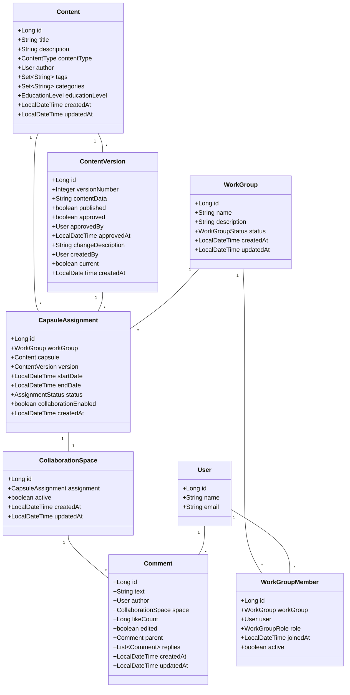
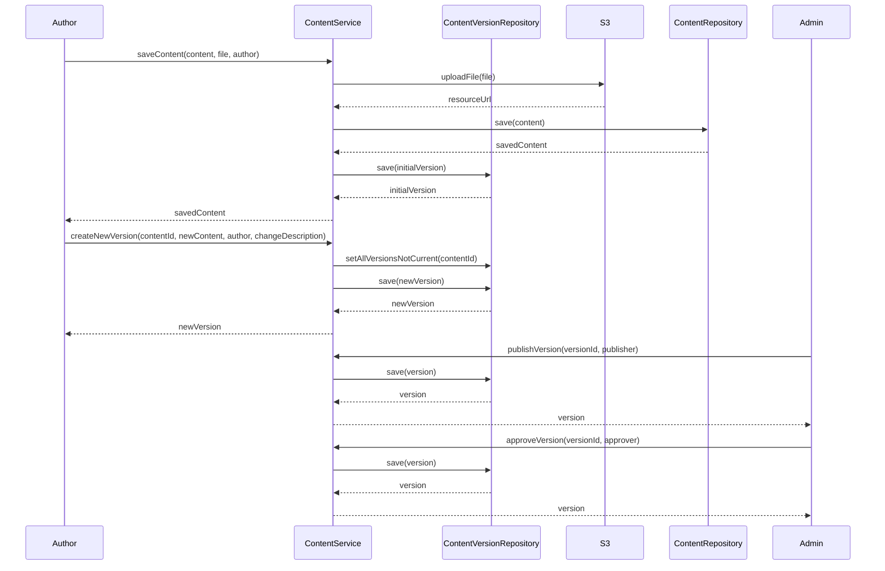

# CapsulasCba - Plataforma de Microaprendizaje Colaborativo

## Descripción del Proyecto

CapsulasCba es una plataforma de microaprendizaje colaborativo que permite a estudiantes crear y compartir pequeñas lecciones o "cápsulas" de conocimiento sobre diversos temas. La plataforma conecta estudiantes con recursos educativos personalizados y fomenta la creación y compartición de conocimiento entre pares, aprovechando la inteligencia colectiva de la comunidad estudiantil.

Características principales:
- Creación y gestión de cápsulas de conocimiento
- Sistema de versionado de contenido con aprobación y publicación
- Grupos de trabajo colaborativos
- Asignación de cápsulas a grupos por períodos específicos
- Espacios de colaboración para cada asignación de cápsula
- Sistema de comentarios y discusiones dentro de los espacios de colaboración

## Arquitectura de Alto Nivel


## Modelo de Datos

El siguiente diagrama muestra el modelo de datos detallado para el sistema de cápsulas y grupos de trabajo:



## Content Versioning Flow

The following diagram illustrates the content versioning flow:



## Stack Tecnológico

### Frontend
- **Framework**: React.js
- **Gestión de Estado**: Redux con Redux Toolkit
- **Enrutamiento**: React Router
- **UI/UX**: Material-UI
- **Internacionalización**: 
  - i18next para gestión de traducciones
  - react-i18next para integración con React
  - Soporte para español (default) e inglés
  - Archivos de traducción en formato JSON
  - Cambio de idioma dinámico desde el header
- **Empaquetador**: Webpack
- **Testing**: Jest, React Testing Library

### Backend
- **Framework**: Spring Boot (Java)
- **Autenticación**: Spring Security, JWT
- **API**: RESTful con Spring MVC
- **Base de Datos**: PostgreSQL
- **ORM**: Hibernate/JPA
- **Mensajería**: AWS SQS
- **Almacenamiento**: AWS S3
- **Testing**: JUnit, Mockito

## Configuración del Proyecto

### Requisitos Previos
- Node.js (v18.x o superior)
- npm (v8.x o superior)
- Java Development Kit (JDK) 17 o superior
- Maven 3.8.x o superior
- PostgreSQL 13 o superior

### Configuración del Frontend

1. Navega al directorio del frontend:
   ```
   cd frontend
   ```

2. Instala las dependencias:
   ```
   npm install
   ```

3. Inicia el servidor de desarrollo:
   ```
   npm start
   ```

   La aplicación estará disponible en `http://localhost:3000`.

4. Para construir la aplicación para producción:
   ```
   npm run build
   ```

### Configuración del Backend

1. Navega al directorio del backend:
   ```
   cd backend
   ```

2. Compila el proyecto:
   ```
   mvn clean install
   ```

3. Ejecuta la aplicación:
   ```
   mvn spring-boot:run
   ```

   El servidor estará disponible en `http://localhost:8080`.

## Estructura Detallada del Proyecto

```
capsulascba/
├── frontend/
│   ├── public/
│   │   └── index.html
│   ├── src/
│   │   ├── components/
│   │   │   └── common/
│   │   │       ├── CustomSnackbar.jsx    # Componente de notificaciones
│   │   │       ├── Footer.jsx            # Pie de página común
│   │   │       ├── Header.jsx            # Encabezado con navegación y cambio de idioma
│   │   │       ├── ProtectedRoute.jsx    # Componente para rutas protegidas
│   │   │       └── Sidebar.jsx           # Barra lateral de navegación
│   │   ├── layouts/
│   │   │   ├── AuthLayout.jsx           # Layout para páginas de autenticación
│   │   │   └── MainLayout.jsx           # Layout principal de la aplicación
│   │   ├── locales/                     # Archivos de internacionalización
│   │   │   ├── en.json                  # Traducciones en inglés
│   │   │   └── es.json                  # Traducciones en español
│   │   ├── pages/
│   │   │   ├── auth/
│   │   │   │   ├── ForgotPasswordPage.jsx
│   │   │   │   ├── LoginPage.jsx
│   │   │   │   ├── RegisterPage.jsx
│   │   │   │   └── ResetPasswordPage.jsx
│   │   │   ├── ContentEditorPage.jsx
│   │   │   ├── ContentPage.jsx
│   │   │   ├── HomePage.jsx
│   │   │   ├── NotFoundPage.jsx
│   │   │   ├── ProfilePage.jsx
│   │   │   └── SearchPage.jsx
│   │   ├── services/                    # Servicios para llamadas API
│   │   ├── store/                       # Gestión de estado con Redux
│   │   │   ├── slices/
│   │   │   │   ├── authSlice.js        # Estado de autenticación
│   │   │   │   ├── contentSlice.js      # Estado de contenido
│   │   │   │   └── uiSlice.js          # Estado de la interfaz
│   │   │   └── index.js                # Configuración de Redux
│   │   ├── utils/
│   │   │   └── i18n.js                 # Configuración de internacionalización
│   │   ├── App.jsx                     # Componente principal
│   │   └── index.js                    # Punto de entrada
│   ├── package.json
│   └── webpack.config.js
├── backend/
│   ├── src/
│   │   ├── main/
│   │   │   ├── java/com/capsulascba/api/
│   │   │   │   ├── config/
│   │   │   │   │   ├── AwsConfig.java     # Configuración de AWS
│   │   │   │   │   └── SecurityConfig.java # Configuración de seguridad
│   │   │   │   ├── controller/            # Controladores REST
│   │   │   │   ├── dto/                   # Objetos de transferencia de datos
│   │   │   │   ├── exception/             # Manejo de excepciones
│   │   │   │   ├── model/
│   │   │   │   │   ├── Comment.java           # Modelo de comentarios
│   │   │   │   │   ├── Content.java           # Modelo de contenido
│   │   │   │   │   ├── ContentResource.java
│   │   │   │   │   ├── ContentVersion.java
│   │   │   │   │   ├── User.java              # Modelo de usuario
│   │   │   │   │   ├── WorkGroup.java         # Modelo de grupo de trabajo
│   │   │   │   │   ├── WorkGroupMember.java   # Modelo de miembro de grupo
│   │   │   │   │   ├── CapsuleAssignment.java # Modelo de asignación de cápsula
│   │   │   │   │   └── CollaborationSpace.java # Modelo de espacio de colaboración
│   │   │   │   ├── repository/               # Repositorios JPA
│   │   │   │   │   ├── CommentRepository.java
│   │   │   │   │   ├── ContentRepository.java
│   │   │   │   │   ├── UserRepository.java
│   │   │   │   │   ├── WorkGroupRepository.java
│   │   │   │   │   ├── CapsuleAssignmentRepository.java
│   │   │   │   │   └── CollaborationSpaceRepository.java
│   │   │   │   ├── security/             # Configuración de seguridad
│   │   │   │   ├── service/              # Servicios de negocio
│   │   │   │   ├── util/                 # Utilidades
│   │   │   │   └── CapsulasCbaApplication.java
│   │   │   └── resources/
│   │   │       └── application.properties # Configuración de la aplicación
│   │   └── test/
│   │       ├── java/
│   │       └── resources/
│   └── pom.xml
└── README.md
